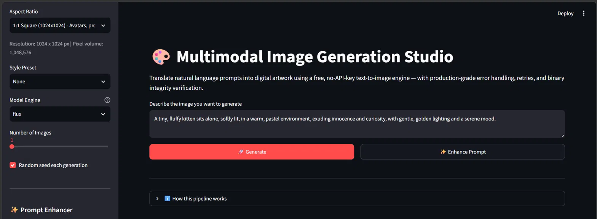
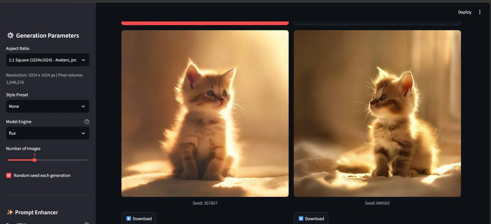

# 🎨 Multimodal Image Generation Studio

A Streamlit application that translates natural language text prompts into high-quality digital artwork, built with production-grade API orchestration: split timeouts, retry with exponential backoff, chunked binary streaming, and forced pixel-level integrity verification.

## Screenshots

**App Interface**


**Generated Output**


## Features

- 🖼️ Text-to-image generation via [Pollinations.ai](https://pollinations.ai) — **free, no API key required**
- ✨ AI Prompt Enhancer — expands short prompts into rich, detailed descriptions using Groq's Llama 3.3 70B
- 📐 Aspect ratio presets mapped to exact pixel resolutions (1:1, 16:9, 9:16, 4:3, 3:4)
- 🎭 Style presets (Cyberpunk, Minimalism, Watercolor, Photorealistic, Anime, Oil Painting)
- 🔁 Multiple model engines (flux, turbo, flux-realism, flux-anime, flux-3d)
- 🔢 Batch generation (1-4 images per request)
- 🌱 Fixed or random seed control for reproducibility
- ⬇️ One-click download of generated assets

## Architecture

The pipeline follows a 6-stage design for reliability:

1. **Prompt Payload Formulation** — prompt + style preset URL-encoded, aspect ratio mapped to exact width/height.
2. **Network API Gateway** — split timeout policy: `3.05s` connect / `90s` read, to tolerate slow GPU-bound generation without hanging forever.
3. **Security & Moderation Gates** — HTTP `403`/`451` responses handled gracefully as content-policy blocks instead of crashing.
4. **Transport Protocol** — memory-safe **64 KiB chunked streaming** instead of loading the full image into RAM at once.
5. **Integrity Verification** — every image is forced through `Image.open().load()` for a full pixel-level decode, catching truncated/corrupted downloads that a shallow header check would miss.
6. **Resilience** — transient failures (`429`, `5xx`, timeouts) are retried automatically with **exponential backoff + jitter**, up to 4 attempts.

## Setup

```bash
pip install -r requirements.txt
streamlit run app.py
```

To use the Prompt Enhancer, get a free Groq API key at [console.groq.com](https://console.groq.com) and either:
- create a `.env` file with `GROQ_API_KEY=your_key_here`, or
- paste it directly into the sidebar field at runtime.

## Usage

1. Enter a text prompt describing the image you want.
2. (Optional) Click **Enhance Prompt** to let Llama 3.3 expand it into a richer, more detailed description.
3. Choose aspect ratio, style preset, model engine, and number of images.
4. Click **Generate**.
5. Preview, and download the verified PNG output.

## Tech Stack

- Python 3
- Streamlit (UI)
- Requests (HTTP client with timeout/retry logic)
- Pillow (image integrity verification)
- Pollinations.ai (free text-to-image inference API)

## Key Learnings

- Handling binary image streams safely without loading full files into memory
- Designing a split connect/read timeout strategy for slow AI inference endpoints
- Implementing exponential backoff + jitter for resilient API calls
- Forcing rigorous pixel-level decode to catch silent truncated-stream corruption
- Mapping user-facing aspect ratio choices to exact API-safe pixel payloads
